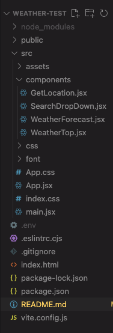

# WeatherView App
# Table of Contents
- [Description](#description)
- [Additional Description](#additional-description)
- [Deployed App](#deployed-app)
- [App Features](#app-features)
- [Teck Stack](#tech-stack)
- [Folder Structure](#folder-structure)
- [Specificity Implemented](#specificity-implemented)
- [Contributors and Code Details](#contributors-and-code-details)
- [Improvements from ToDo App's Feedback](#improvements-from-todo-apps-feedback)
- [API EndPoints](#api-endpoints)
- [Figma UI's Link](#figma-uis-link)
- [App Flow](#app-flow)
- [Git Flow Method](#git-flow-method)
- [Convention Guide](#convention-guide)
## Description
This WeatherView app is built using React and OpenWeathermap API. It has components that would fetch the current geo-location, request the data from OpenWeathermap API based on the current location, and render/display the current weather. 

## Additional Description: 
- WeatherView also uses current location data to update the background through Unsplash API.
- It also allows searching for city name using OpenCageData API.
- Once selected, the app will fetch weather data and display the current and forecast data based on the user's timezone. 

# [Deployed App](https://weather-view-nilin.vercel.app/)

## App Features:
- Fetch the current geo-location
- Request weather information from OpenWeatherMap API
- Display the received information and forecast weather for the next 4 days
- Allow search-suggest dropdown and fetch selected city data to display both current weather and forecast

## Tech Stack 
- React JS
- Open WeatherMap API, Unsplash API, Opencage Data API 
- Vite
- JSX
- CSS
- Figma

## Folder Structure: 

### Specificity Implemented:
- react useState, useEffect , useRef(for testing purposes)
- react axios
- react-geolocated module
- [Weather Icons](https://erikflowers.github.io/weather-icons/)

## Contributors and Code Details:
* GetLocation.jsx: Fetching Location with axios: Tutorials from: https://www.npmjs.com/package/react-geolocated 
* App.jsx: API fetch both for current weather and forecast days is done using fetch (trying out both fetch and axios) done after research from various sources from Google
*WeatherTop.jsx and WeatherForecast.jsx: displaying Weather Data both is done by Nilin using object casting and accessing json object through their index. 
* Fetching City List for search is done using OpencageData API 
* Searchable DropDown input state is made by researching tutorials from Google and help from AnB Prime's Sophanit for setting up input state (for example, values, and reset state).
* Initially, an .env file was used to store API data but I found out after finishing that it would not be visible on Github, I had to branch a hotfix to fix this issue, and finish up my search component. 

## Improvements from ToDo App's Feedback
- Separated components based on UI and functions: Initially, the API fetching is done in a separate component but I decided to move it into App.jsx as it is only functions and no UI. 
- Branch processing: if the data from API or the location failed to load there is separate loading parts shown to users in both form of a console.log or a loading screen.
- File and folder structure naming: I tried to name my components as clear as possible to show their purpose and position when rendered in the website. 

## API EndPoints:
- CurrentWeather: https://api.openweathermap.org/data/2.5/weather?lat={lat}&lon={lon}&units=metric&appid={API key} 
- ForecastWeather: https://api.openweathermap.org/data/2.5/forecast?lat=44.34&lon=10.99&units=metric&appid={API key}
- Search City (OpenCageData): https://api.opencagedata.com/geocode/v1/json?q=URI-ENCODED-PLACENAME&key={API key}
- Background image API: https://api.unsplash.com/search/photos

## [Figma UI's Link](https://www.figma.com/file/yT1kgNPMGwJ6EtUn9fy81N/Weather-App?type=design&node-id=7%3A99&mode=design&t=MD0nB0bXHR1Q26V5-1)

## [App Flow](https://www.figma.com/file/npIs51ILcHHjOqyBZMsHDt/WeatherView-App-Flow?type=whiteboard&node-id=0%3A1&t=iropHjHjy0UVLexH-1)

## Git Flow Method: 
1. Main Branch:
1st commit and Main stores the source as well as stable versions of the code
2. Develop:
It's the base branch of all feature branches and release branch.
Develop branch initially contains source code from main and add task function
All feature branches () are merged into develop. -Develop represent the latest state of the App being developed.
3. Feature Branches:
Features that represents all the functions of the app
The feature branches include:
feature/issue1: Visualize current weather after fetching from API
feature/issue2: Visualize forecast data after fetching from API
feature/issue3: Search bar by dropdown draft.
4. Release Branch:
This is the branch for the app deployment and is based off of develop branch.
The tag is in the form of 1.0, 1.1, etc.
Current release version: release/1.1
5.Bugfix branch:
This is the branch used when fixing bugs in release branch.
The current bugfix used is the bugfix/issue7 branch.
This branch is branched for the current release/1.0 branch.
6. Hotfix branch:
There was a hotfix branch used to fix .env (API resources) error and fixing searchdropdown component. 

# Convention Guide:
Use the existing folder structure of a React App generated by Vite

## File naming:
HTML files must be all lowercase and ending with .html
CSS files should all be PascalCase ending with .css

Javascript-React files should be PascalCase ending with .jsx

Images should be named with dashes and lowercase letters.

## UX/UI guide:
Use Heading in hierarchy: h1 -> h2 -> h3 ....
Layout of content: always use frame for the layout
Indentation: 20px between elements (y axis)

### Icon Size:
Max-width: 48px (include touch area)
### Border Radius: 5px
### Font family :'Roboto', sans-serif;
### Font size:
- Title: 58px , line height: 40px, font weight: 500
- h2: 28px , line height: 36px, font weight: 500
- h3: 24px , line height: 32px, font weight: 500
- h1: 32px , line height: 40px, font weight: 500
- Title large- 22px, line height: 28px, font weight: regular

### Color:
- Primary: #E3F4FE
- On Primary: #2B374D
- Secondary: #6288A3
- On Secondary: #FFFEF9
- Background image: generated based on current location

### Grid
Large min 1440px:
12 columns, centered, each width: 72px, Gutter: 24px
Medium min(900px):
12 columns, stretch, Margin 24px, Gutter: 24px
Small (from 900px-600px):
8 columns, stretch, Margin: 32px, Gutter: 16px
### Components
- Weather Icons from: https://erikflowers.github.io/weather-icons/

## CSS Guide:
### Grid: Using Flexboxes
### Formatting
- Use soft tabs (2 spaces) for indentation
- Use dashes instead of camelCasing names
- Try not to use id selectors as much as possible
- Put a space before a rule’s opening braces
- Try to write one rule per line
- in properties, put a space after the :
- Put closing braces on a new line
### Comments
- Comments on same line for notes on rule
- Comments as a line to mark different rule’s section
## React-JSX Guide:
- Try to include only one component per file.
- Use JSX syntax
- Use .jsx extensions for all components
- Use PascalCase for naming files, components, and their instances
- Use PascalCase when importing components and css file
- Use double quotes instead of single quotes
- Always include 1 space in all self-closing tags
- Do not pad curly braces with spaces
- Use camelCasing names for props
- Include alt on img tags for accessibility purposes
- Do not write “picture”, “pic”, “image”, “photo”, etc for the alt of the image element
- Wrap JSX tags in parentheses when they span more than one line
- Always self-close a tag that have no children
- Use arrow functions to close over local variables
### [Convention Guide reference](https://github.com/airbnb/javascript/tree/master/css-in-javascript)
